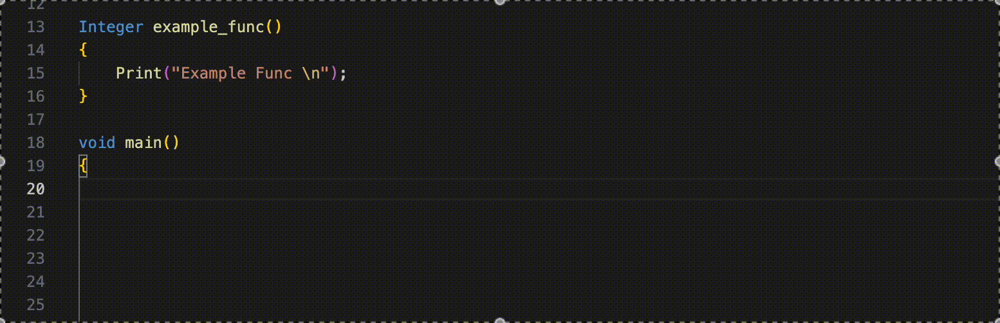
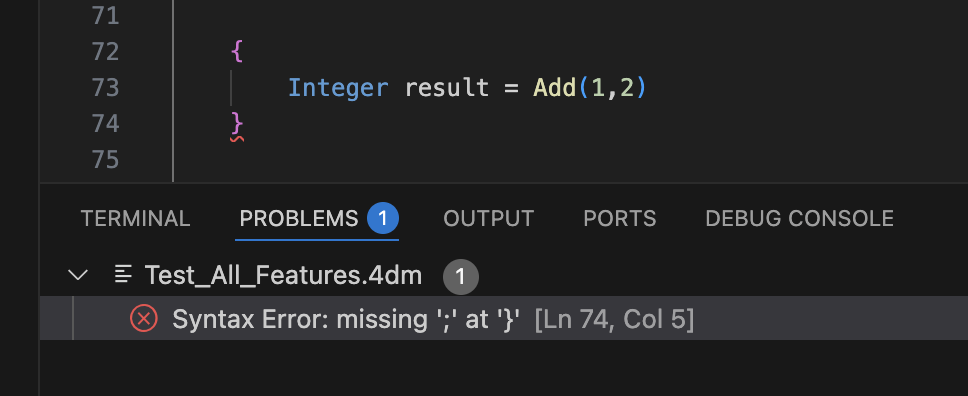
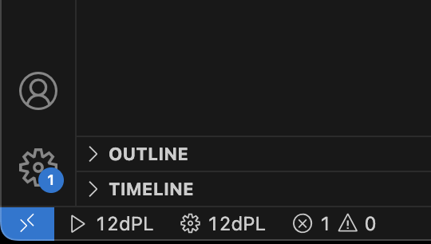

# 12dPL Language Server

A professional language server for 12dPL with intelligent code completion and real-time validation.

This repository’s documentation is split into the following Markdown files:
- `README.md` - General User Information and Features
- `CONTRIBUTING.md` - Developer specific information.

## Table of Contents

- Features
- Quick Start Guide
- Usage
- Configuration
- Dependencies
- License
- Contributing
- Contributors

---

## ✨ Features

### Implemented
- **Syntax Highlighting** - Full 12dPL grammar support
- **Code Completion** - Builtins + local symbols + include-aware symbols
- **Real-time Validation** - ANTLR-based code parsing and error detection
- **AST Parsing** - Complete abstract syntax tree generation
- **Function Documentation** - Hover over builtins, local symbols, include symbols, and `#define` macros
- **Go to Definition** - Works for local symbols and across included files (including `#define` macros)
- **Signature Help** - Parameter info tooltip appears as you type, with active parameter highlighted and all overloads shown
- **Rename All Symbols** - Scope-aware rename across the current file (F2 or right-click > Rename Symbol)
- **Formatting** - Brace-based formatting with configurable bracket style, indent style, and line-length wrapping (supports format-on-save)
- **Preprocessor Support** - `#include`/`#define` suggestions, include-path completion, macro completion, and macro expansion during validation
- **Advanced Grammar Support** - Arrays, Switch statements, Pass-by-reference, Macros
- **Document Outline** - Functions and global variables shown in the VS Code outline panel and breadcrumb bar
- **Semantic Highlighting** - Macro definitions and uppercase constants are highlighted distinctly
- **Control Flow Validation** - Detects unreachable code, missing `break` in `switch` cases, and `switch` without `default`
- **Assignment Type Validation** - Reports type mismatches and lossy promotions in assignments
- **Logical Condition Validation** - Warns on non-boolean loop/condition expressions
- **Array Size Validation** - Flags unsized array declarations in function bodies
- **Undeclared Symbol Detection** - Flags calls to functions not declared locally, in headers, or in built-in prototypes

### Coming Soon
- Document Highlights: highlights all matching symbols in a text document
- Find References: find all references to a symbol
- List Workspace Symbols: lists all project-wide symbols

---

### What's New in v1.5.4

**Preprocessor Macro Substitution** ✨
- Macros are now expanded during validation so the validator correctly analyses code that uses macro-defined values
- Original macro symbols are preserved alongside expanded forms, keeping completion and hover working on macro names

**Bug Fixes**
- Block comment bracket colours: brackets inside block comments are no longer coloured as code brackets
- Forward declaration false positives in header files are no longer incorrectly reported as redeclarations

## 🚀 Quick Start Guide

### What's New

✨ **Auto-Completion with 8000+ Library Functions**

The language server provides intelligent auto-completion for all 12dPL library functions including:
- Mathematical functions (Sin, Cos, Tan, etc.)
- String operations
- File I/O
- Control flow
- And much more...

---

## 💡 Usage

### Auto-Completion
1. Open a `.4dm` file
2. Start typing a function name or variable (Can be user defined) (e.g., "Sin", "Print")
3. Auto-complete suggestions appear
4. Press `Ctrl+Space` to manually trigger

### Diagnostics - Error Checking
- Syntax errors appear with red squiggles
- View all errors in the Problems panel
- Navigate with F8 (next problem)

### Auto-Format on Save (C/C++-Style)

This extension provides a basic C/C++-style formatter (brace-based indentation) for `.4dm` files.

Format-on-save is disabled by default, if you wish to use this feature it can be enabled in the extensions settings.

### Compile a `.4dm` File (Play Button)

This extension can invoke the 12dPL compiler and can compile the current file into a `.4do` in the same folder.

1. Open a `.4dm` file
2. Click the **Play** button (`▶ 12dPL`) in the VS Code status bar to compile immediately **or** run **“12dPL: Compile Current File”** from the Command Palette
3. Check the Output panel: **12dPL Compiler**

The Output also prints the detected `cc4d` compiler version, and the Play button tooltip shows it when available.

#### Compiler Flags (Checkboxes)

To compile with selectable flags, use the **Gear** button (`⚙ 12dPL`) in the status bar or run **“12dPL: Compile Current File (Select Flags)”**.

---

## 🔧 Configuration
There are a few available settings that are defined for the language server that can be used to customise the way the language server behaves. They are listed below with a description of their use.

- 12dpl.compiler.availableFlags 
	- List of cc4d compiler flags to show as checkboxes when compiling. Each entry may include arguments, e.g. '-log \"build.log\"' or '-codepage 1252'.
- 12dpl.compiler.path 
	- Path to the folder containing the cc4d.exe compiler. Example: C:\\Program Files\\12d\\12dmodel\\15.00\\nt.x64\\
- 12dpl.compiler.includePaths 
	- List of folders to prepend to the PATH environment variable before running the compiler (useful for include directories). Use platform paths; on Windows use semicolon-separated PATH semantics.
- 12dpl.compiler.defaultFlags 
	- Default cc4d flags to preselect in the compile checkbox picker. Last selection is remembered per-workspace.
- 12dpl.formatOnSave 
	- Auto-format 12dPL files when they are saved.
- 12dpl.indentSize 
	- Indent size (spaces) used by the 12dPL formatter.
- langServer.maxNumberOfProblems 
	- Controls the maximum number of problems produced by the server.
- langServer.trace.server 
	- Traces the communication between VS Code and the language server.

---

## 📦 Dependencies

### Core
- `vscode-languageserver` - LSP implementation
- `vscode-languageserver-textdocument` - Text document handling
- `antlr4` - Parser generation

### Data
- `xml2js` - XML parsing for prototypes

---

## 📄 License

MIT License - See `LICENSE` file for details

## 👥 Contributing

Contributions welcome! Please submit pull requests or issues.

## 👤 Contributors 

**Ben Olsen**

**Kamal Jarada** 
